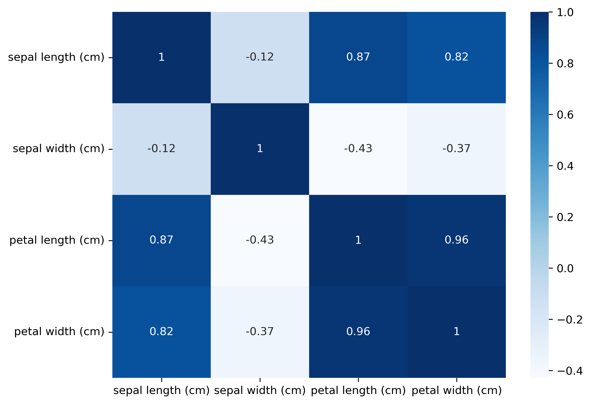
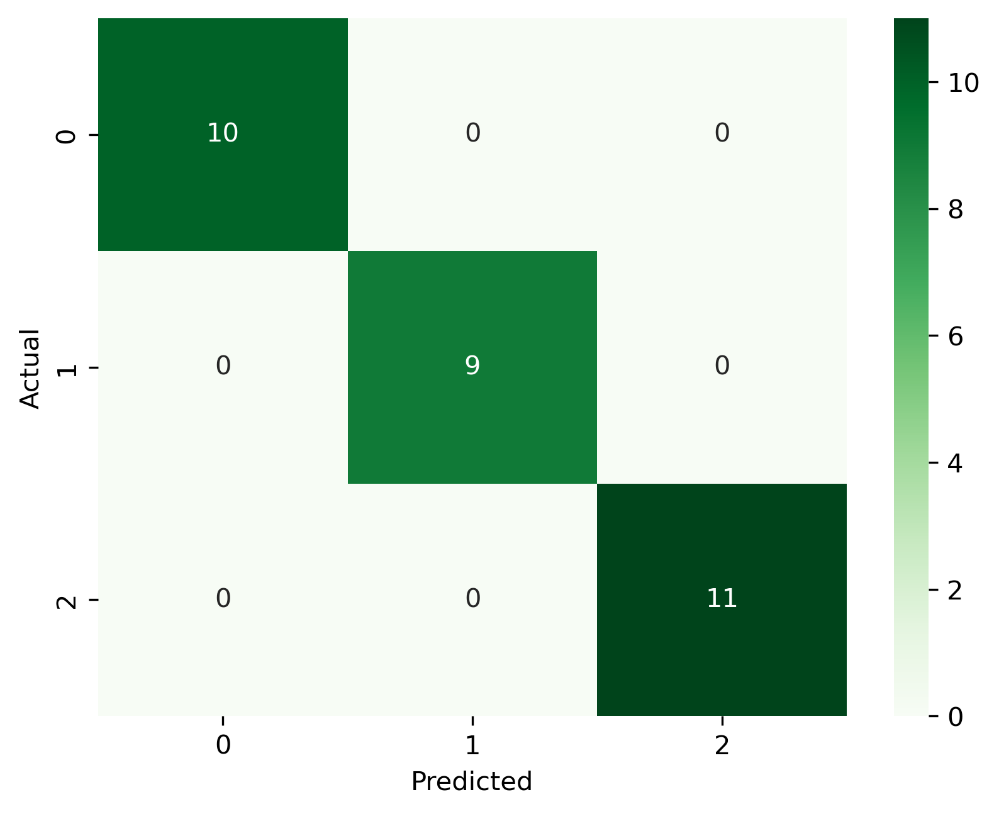

# Iris Flower Classification

## Objective

Build a machine learning model to classify Iris flowers into three species:
- Setosa
- Versicolor
- Virginica

## Technologies Used

- Python
- Jupyter Notebook
- Pandas
- NumPy
- Matplotlib
- Seaborn
- Scikit-learn

## Dataset

The Iris dataset from Scikit-learn.

## Machine Learning Model

Random Forest Classifier

## Steps Performed

- Loaded the dataset
- Explored and visualized the data
- Split data into training and testing sets
- Trained the Random Forest model
- Predicted flower species
- Evaluated the model using:
  - Accuracy Score
  - Confusion Matrix
  - Classification Report

## Results

- Accuracy: **100%**
- Precision: **1.00**
- Recall: **1.00**
- F1-score: **1.00**

## Project Structure

```text
Task-1-Iris-Flower-Classification/
│
├── iris_flower_classification.ipynb
├── README.md
├── requirements.txt
└── images/
    ├── pairplot.png
    ├── correlation_heatmap.png
    └── confusion_matrix.png
```

## Author

Ravi Baliyan

## Project Visualizations

### Pair Plot


### Correlation Heatmap



### Confusion Matrix

